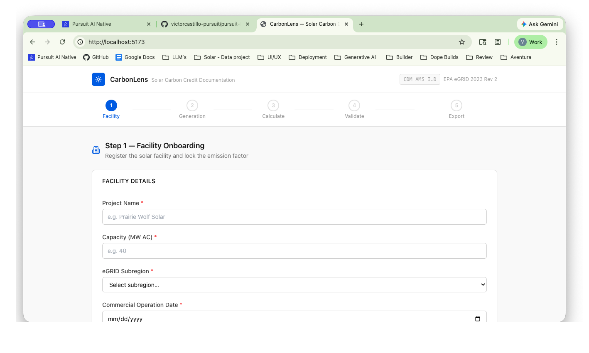
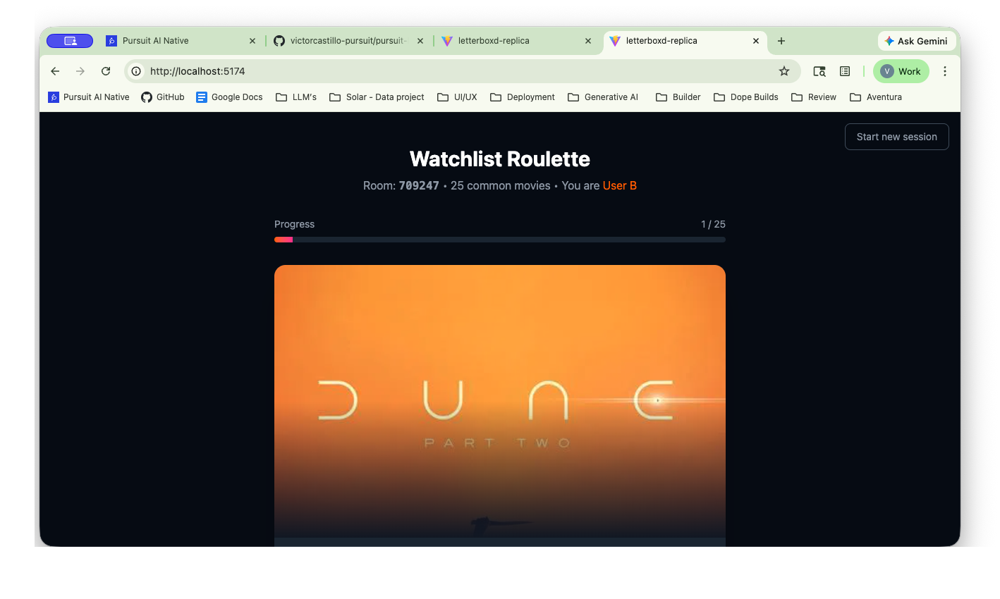
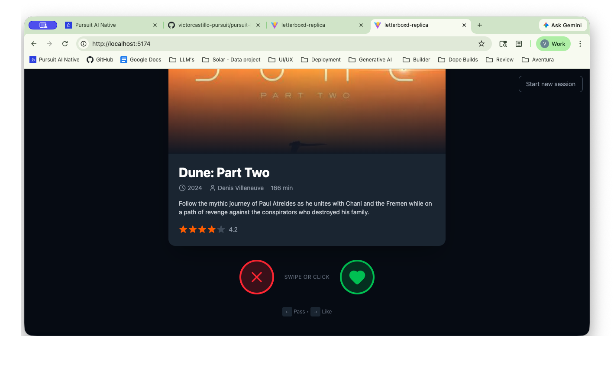
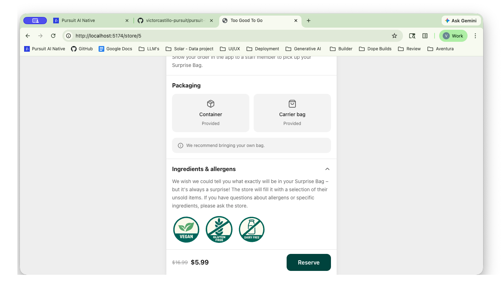

# My L2 Portfolio

AI-native full stack developer with a focus on health and wellness, and 15 years of hands-on experience in telecommunications — spanning cable installation, satellite systems, and field management. I bring an operator's mindset to software: building reliable, user-centered applications that work in the real world.

**Stack:** React · TypeScript · Tailwind CSS · Python · SQL

---

## Projects

### [CarbonLens](./carbonlens)

Solar energy producers lack a simple, auditable way to calculate and document the carbon credits their systems generate. Existing tools are either too complex, require specialized software, or lack the transparency needed for third-party verification. There's no simple, self-contained workflow for a facility to go from raw generation data to a verified, exportable carbon credit report aligned with EPA emission standards.

CarbonLens provides a step-by-step browser-based documentation tool that guides users from facility setup to a verified, exportable carbon credit report. It applies EPA eGRID 2023 emission factors to raw generation data and produces a tamper-evident PDF — all client-side with no backend required.

**Key Features**
- Step-by-step guided workflow from facility input to carbon credit report export
- EPA eGRID 2023 emission factor calculations across 27 subregions
- SHA-256 cryptographic hashing for tamper-evident audit trail
- Client-side PDF generation with no backend or data storage required
- CSV generation data import via PapaParse for bulk entry

**Tech Stack**
| Layer | Technologies |
|---|---|
| Frontend | React 18, TypeScript, Vite, Tailwind CSS |
| Libraries | jsPDF, JSZip, PapaParse, lucide-react |
| Security | Web Crypto API (SHA-256) |
| Data | EPA eGRID 2023 Rev 2 (embedded, no external API calls) |

[View Sample Monitoring Report](./assets/carbonlens/monitoring_report.pdf)

---

### [Letterboxd Replica](./letterboxd-replica)

Deciding what to watch as a couple or group is a frustrating experience — scrolling through individual watchlists, negotiating preferences, and still landing on a film nobody is fully excited about. Letterboxd's existing watchlist is a solo tool with no native way to match overlapping interests between two users.

This project replicates Letterboxd's watchlist feature and extends it with a Roulette mode — a Tinder-style swipe mechanic that cross-references two watchlists and surfaces movies both users want to watch. State persists locally in the browser with no account or backend required.

**Key Features**
- Letterboxd-style watchlist grid with hover interactions (add, remove, mark watched, rate)
- Roulette mode: Tinder-style swipe mechanic to match movies across two watchlists
- TMDB API integration for real movie search and poster data
- localStorage persistence — no signup, works offline after load
- Responsive grid layout (mobile → desktop) with smooth animations

**Tech Stack**
| Layer | Technologies |
|---|---|
| Frontend | React 19, TypeScript, Vite, Tailwind CSS 4 |
| Icons | lucide-react |
| Data | TMDB API |
| Storage | localStorage |

---

### [Too Good To Go](./toogoodtogo)

Too Good To Go helps reduce food waste by letting users reserve discounted surplus food from local stores — but the app offers no way for users with dietary restrictions to know if a store's surprise bag is safe for them. Users with allergies or specific diets have no visibility before reserving.

This project is a pixel-perfect desktop adaptation of the Too Good To Go mobile app, built as a team. The UI clone replicates the full Discover and Store Detail experience, while the feature improvement adds dietary certification symbols (vegan, dairy-free, gluten-free, nut-free) to the store detail page — giving users the dietary context they need before making a reservation.

**Key Features**
- Pixel-perfect desktop adaptation of a mobile-only app (centered 480px container)
- Discover page with category filters, horizontal scrollable store carousels, and live navigation
- Full store detail page: hero image, ratings, pickup info, packaging, directions, and sticky reserve footer
- Dietary certification symbols displayed in the allergens section per store
- Mock data with realistic NYC store names, pricing, pickup windows, and ratings

**Tech Stack**
| Layer | Technologies |
|---|---|
| Frontend | React 19, Vite, Tailwind CSS 3 |
| Routing | React Router v7 |
| Icons | lucide-react |
| Data | Mock JSON (no backend) |

---

### [Strava Clone](./strava-clone)
> Placeholder description for Strava Clone.

---

*More projects coming soon.*
